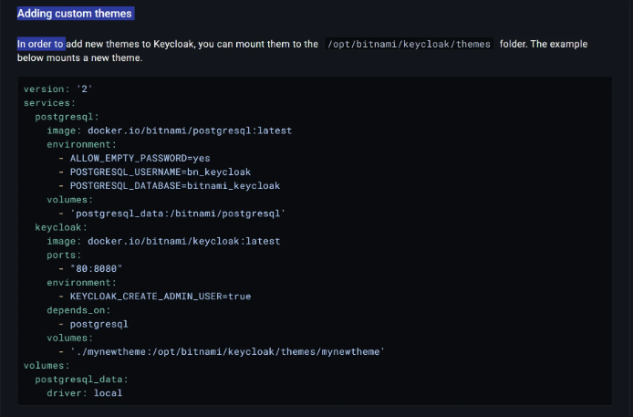
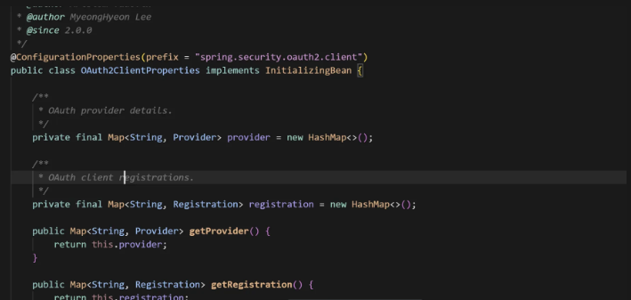
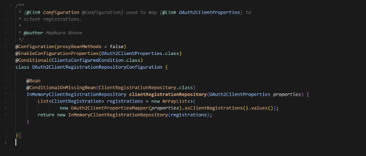
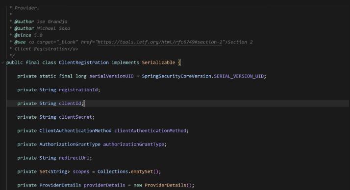
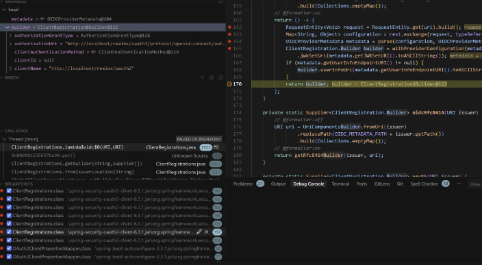

# Spring-Security-oauth2

## 커밋 규칙
| init | 프로젝트 생성 |
| --- | --- |
| feat | 새로운 기능에 대한 커밋 |
| build | 빌드 관련 파일 수정 / 모듈 설치 또는 삭제에 대한 커밋 |
| chore | 그 외 자잘한 수정에 대한 커밋 |
| docs | 문서 수정에 대한 커밋 |
| style | 코드 스타일 혹은 포맷 등에 관한 커밋 |
| refactor | 코드 리팩토링에 대한 커밋 |
| test | 테스트 코드 수정에 대한 커밋 |
| perf | 성능 개선에 대한 커밋 |

## OAuth2.0의 기본 원리란?
- OAuth = Open + Authorization
기본 원리는 유저가 승인하에 다른 서버에 유저의 정보를 줄 수 있다는 것을 의미함 -> 이러한 역할을 하는 것이 인가 서버라고 함.

## OAuth2.0 Roles
- OAuth2.0 메커니즘은 다음 4가지 종류의 역할을 담당하는 권한 부여 체계이다.

1. Resource Owner
- 보호된 자원에 대한 접근 권한을 부여할 수 있는 주체
- 사용자를 대신해서 작동하려는 모든 클라이언트는 사용자의 허가부터 받아야 된다.

2. Resource Server
- 타사 어플리케이션에서 접근하는 사용자의 자원이 포함된 서버를 의미
- 액세스 토큰을 수락 및 검증할 수 있어야 하며 권한 체계에 따라 요청 승인할 수 있어야 한다.

3. Authorization Server
- 클라이언트가 사용자 계정에 대한 동의 및 접근을 요청할 때 상호작용하는 서버로 클라이언트의 권한 부여 요청을 승인하거나 거부하는 서버
- 사용자가 클라이언트에게 권한 부여 요청을 승인한 후 accessToken을 클라에게 부여하는 역할

4. Client
- 사용자를 대신해서 권한을 받아 사용자의 리소스에 접근하려는 애플리케이션
- 사용자를 권한 부여 서버로 안내하거나 사용자의 상호작용 없이 권한 부여 서버로부터 직접 권한을 얻을 수 있다.

우리는 보통 Client만 사용해서 다른 인가 서버인 구글, 네이버, 카카오에 인가 요청을 하게 되고 이후 토큰을 가지고 인증을 처리하게 된다.

## OAuth2.0의 오해
OAuth2.0은 인가와 인증 처리를 내부적으로 같이 처리하기 때문에 인증프레임워크라고 알기 쉬운데 OAuth2.0은 인가 프레임워크이다.


## OAuth2.0 권한 부여 유형
1. Authorization Code Grant Type : 권한 코드 부여 타입, 서버 사이드 어플리케이션, 보안에 가장 안전한 유형
- 1단계 : 인가 서버로부터 code를 받아온다.
- 2단계 : code를 통해서 accessToken, refreshToken을 받아온다. => 여기까지가 인가 단계
- 3단계 : accessToken을 통해서 사용자 정보를 받아온다. => 여기부터 인증 단계
2. Client Credentials Grant Type : 클라이언트 자격 증명 권한 부여 타입, 화면이 없는 서버 어플리케이션
- 1단계 : 인가 서버로부터 code를 받아온다.
- 2단계 : code를 통해서 accessToken, refreshToken을 받아온다. => 여기까지가 인가 단계

⇒ 서버끼리의 통신과정에서 필요한 타입 사용자의 정보는 필요 없다 -> 사용자 인증 처리에 대한 개념이 없음 

3. Refresh Token Grant Type : 새로고침 토큰 부여 타입, Authorization Code, Resource Owner Password Type에서 지원

4. PKCE-enhanced Authorization Code Grant Type : PKCE 권한 코드 부여 타입, 서버 사이드 어플리케이션, 공개 클라 어플리케이션

⇒ 1단계에서 하나의 매개변수가 더 존재한다. code(기존의 코드와는 다른 코드임)
⇒ 2단계에서 코드와 알고리즘을 전달한다. 2개의 매개변수가 더 필요(인가 서버와 비교를 통해서 동일한 클라이언트일 경우에만 허용)
여기서 1단계의 처리 과정이 더 늘어난다고 생각하면 된다.

## OpenID connect 1.0
OpenID Connect 1.0은 OAuth 2.0 프로토콜 위에 구축된 ID 계층으로 OAuth2.0을 확장하여 인증 방식을 표준화한 OAuth2.0 기반의 인증 프로토콜이다.

- scope 지정 시 openid를 포함하면 OpenID Connect 사용이 가능하며 인증에 대한 정보는 ID 토큰이라는 JSON 웹 토큰으로 반환한다.
- OpenID Connect는 클라이언트가 사용자 ID를 확인할 수 있게 하는 보안 토큰인 ID Token을 제공한다.

> 인증을 위한 프로토콜이다. 스코프에 openid가 포함되면 인가서버에서 openid connect를 사용한다.

OpenID Connect를 사용하기 위해 필요한 모든 엔드 포인트 및 공개 키 위치 정보를 포함 하여 OpenId 공급자의 구성에 대한 클레임 집합을 나타낸다.

## 인가 서버
인가 서버의 역할을 제공하는 오픈소스가 있는데 KeyCloak이라는 걸 가지고 사용할 수 있다

- 설치 방법
dockerHub에 bitnami에서 제작한 keyCloak를 제공하는 걸 확인할 수 있었는데 공식적으로 사용하는 방법은 다음과 같다.



```
version: '3.8'

services:
  postgresql:
    image: docker.io/bitnami/postgresql:latest
    environment:
      - ALLOW_EMPTY_PASSWORD=yes
      - POSTGRESQL_USERNAME=bn_keycloak
      - POSTGRESQL_DATABASE=bitnami_keycloak
    volumes:
      - 'postgresql_data:/bitnami/postgresql'

  keycloak:
    image: docker.io/bitnami/keycloak:latest
    ports:
      - "80:8080"
    environment:
      - KEYCLOAK_CREATE_ADMIN_USER=true
      - KEYCLOAK_ADMIN_USER=admin
      - KEYCLOAK_ADMIN_PASSWORD=admin
      - KEYCLOAK_DATABASE_HOST=postgresql
      - KEYCLOAK_DATABASE_NAME=bitnami_keycloak
      - KEYCLOAK_DATABASE_USER=bn_keycloak
      - KEYCLOAK_DATABASE_PASSWORD=
    depends_on:
      - postgresql
    volumes:
      - './mynewtheme:/opt/bitnami/keycloak/themes/mynewtheme'

volumes:
  postgresql_data:
    driver: local
```

> 이처럼 인가서버를 가지고 테스트하고 로그인을 진행해볼 수 있다.

## OAuth2.0 초기 설정 과정
security에서 oauth2를 사용할 경우 우리는 yml 파일에 필요한 정보들을 기입해주면 되는데 어떻게 알 수 있을까?

**OAuth2ClientProperties**

이 클래스에 자세하게 나와있다 여기를 살펴보면 prefix로 spring.security.oauth2.client 이 값을 주고 값 셋팅은 
```
private String provider;

		/**
		 * Client ID for the registration.
		 */
		private String clientId;

		/**
		 * Client secret of the registration.
		 */
		private String clientSecret;

		/**
		 * Client authentication method. May be left blank when using a pre-defined
		 * provider.
		 */
		private String clientAuthenticationMethod;

		/**
		 * Authorization grant type. May be left blank when using a pre-defined provider.
		 */
		private String authorizationGrantType;

		/**
		 * Redirect URI. May be left blank when using a pre-defined provider.
		 */
		private String redirectUri;

		/**
		 * Authorization scopes. When left blank the provider's default scopes, if any,
		 * will be used.
		 */
		private Set<String> scope;
```
이러한 값들을 셋팅할 수 있는걸 확인할 수 있다.

## 설정 클래스
OAuth2ClientProperties 이를 사용하는 곳을 찾아보면 

이런 설정 클래스가 있는데 여기서 설정을 초기화 해주는 모습을 확인할 수 있다. 잘 보면 ClientRegistration이 값에 바인딩하고 있는데 여기 들어가면

oauth2 통신에 필요한 값들이 뭐뭐가 있는지 확인할 수 있었다. 이 값을 가지고 인가 서버와 통신하는 것이다.

## 우리가 자주 사용하는 인증 서버 제공자
우리가 자주 사용하는 인증 서버 제공자는 어떻게 특정 값을 셋팅 안하고 사용할 수 있는걸까?
```
public enum CommonOAuth2Provider {

	GOOGLE {

		@Override
		public Builder getBuilder(String registrationId) {
			ClientRegistration.Builder builder = getBuilder(registrationId,
					ClientAuthenticationMethod.CLIENT_SECRET_BASIC, DEFAULT_REDIRECT_URL);
			builder.scope("openid", "profile", "email");
			builder.authorizationUri("https://accounts.google.com/o/oauth2/v2/auth");
			builder.tokenUri("https://www.googleapis.com/oauth2/v4/token");
			builder.jwkSetUri("https://www.googleapis.com/oauth2/v3/certs");
			builder.issuerUri("https://accounts.google.com");
			builder.userInfoUri("https://www.googleapis.com/oauth2/v3/userinfo");
			builder.userNameAttributeName(IdTokenClaimNames.SUB);
			builder.clientName("Google");
			return builder;
		}

	},

	GITHUB {

		@Override
		public Builder getBuilder(String registrationId) {
			ClientRegistration.Builder builder = getBuilder(registrationId,
					ClientAuthenticationMethod.CLIENT_SECRET_BASIC, DEFAULT_REDIRECT_URL);
			builder.scope("read:user");
			builder.authorizationUri("https://github.com/login/oauth/authorize");
			builder.tokenUri("https://github.com/login/oauth/access_token");
			builder.userInfoUri("https://api.github.com/user");
			builder.userNameAttributeName("id");
			builder.clientName("GitHub");
			return builder;
		}

	},

	FACEBOOK {

		@Override
		public Builder getBuilder(String registrationId) {
			ClientRegistration.Builder builder = getBuilder(registrationId,
					ClientAuthenticationMethod.CLIENT_SECRET_POST, DEFAULT_REDIRECT_URL);
			builder.scope("public_profile", "email");
			builder.authorizationUri("https://www.facebook.com/v2.8/dialog/oauth");
			builder.tokenUri("https://graph.facebook.com/v2.8/oauth/access_token");
			builder.userInfoUri("https://graph.facebook.com/me?fields=id,name,email");
			builder.userNameAttributeName("id");
			builder.clientName("Facebook");
			return builder;
		}

	},

	OKTA {

		@Override
		public Builder getBuilder(String registrationId) {
			ClientRegistration.Builder builder = getBuilder(registrationId,
					ClientAuthenticationMethod.CLIENT_SECRET_BASIC, DEFAULT_REDIRECT_URL);
			builder.scope("openid", "profile", "email");
			builder.userNameAttributeName(IdTokenClaimNames.SUB);
			builder.clientName("Okta");
			return builder;
		}

	};

	private static final String DEFAULT_REDIRECT_URL = "{baseUrl}/{action}/oauth2/code/{registrationId}";

	protected final ClientRegistration.Builder getBuilder(String registrationId, ClientAuthenticationMethod method,
			String redirectUri) {
		ClientRegistration.Builder builder = ClientRegistration.withRegistrationId(registrationId);
		builder.clientAuthenticationMethod(method);
		builder.authorizationGrantType(AuthorizationGrantType.AUTHORIZATION_CODE);
		builder.redirectUri(redirectUri);
		return builder;
	}

	/**
	 * Create a new
	 * {@link org.springframework.security.oauth2.client.registration.ClientRegistration.Builder
	 * ClientRegistration.Builder} pre-configured with provider defaults.
	 * @param registrationId the registration-id used with the new builder
	 * @return a builder instance
	 */
	public abstract ClientRegistration.Builder getBuilder(String registrationId);

}

```

위 처럼 Common Builder에 정의 되어있는 모습을 확인할 수 있었다. 이로 인해서 yml에 추가로 작성을 안해도 동작이 가능하다.

## OAuth2 구동의 이해
1. OAuth2가 동작하게 되면 먼저 ClientRegistration Repository 빈이 존재하는지 확인하고 없으면 ClientRegistration Repository이 빈을 만들게 된다.
2. 이후 OAuth2ClientPropertiesMapper이 클래스를 통해서 ClientRegistrations 클래스를 가져오게 된다.


3. 그리고 인가 서버에 대한 base url를 지정하게 된다. 이 url을 가지고 통신해서 인가 서버의 메타데이터를 가지고 오게 된다.


> 2가지의 방식이 존재하는데 oidc 방식과 oauth 방식으로 가져온다.

추가적으로 이 ClientRegistrations 클래스에서 확인할 수 있는데 ClientAuthenticationMethod 이 클래스에 들어가면 어떠한 타입을 지원하는지 확인할 수 있다.

1. RestTemplate를 통해서 정보를 가져와서 MapConfiguration을 하고 OIDCProviderMetadata로 변환한다. → map을 객체로 변환한다는 말
2. 최종적으로 ClientRegistration로 생성 및 반환하게 된다.

→ 여기서 MapConfiguration을 한다고 했는데 우리가 따로 application.yml에 설정을 안할 경우에 자동으로 되는 것이고 따로 우리가 설정한 값이 있다면 그 값으로 덮어쓰기 된다.

## yml 설정

본인은 yml 설정을 다음과 같이 진행하였다.

```
server:
    port: 8081

spring:
    security:
        oauth2:
            client:
                registration:
                    keycloak:
                        client-id: oauth2-client-app
                        client-secret: zlvRZaTJGI2dEPwDCXMJBWXL3HdQhpWe
                        client-name: client-app
                        redirect-uri: http://localhost:8081/login/oauth2/code/keycloak
                        authorization-grant-type: authorization_code
                        client-authentication-method: client_secret_basic
                        scope: openid, profile, email
                provider:
                    keycloak:
                        authorization-uri: http://localhost/realms/oauth2/protocol/openid-connect/auth
                        token-uri: http://localhost/realms/oauth2/protocol/openid-connect/token
                        issuer-uri: http://localhost/realms/oauth2
                        user-info-uri: http://localhost/realms/oauth2/protocol/openid-connect/userinfo
                        jwk-set-uri: http://localhost/realms/oauth2/protocol/openid-connect/certs
                        user-name-attribute: preferred_username
```

근데 여기서 기본적으로 가지고 오는 값들이 보니까 다 인가 서버와 통신을 통해서 가지고 오는 모습을 확인할 수 있었다. 그럼 필요없는 값까지 셋팅한 것인데

```
server:
    port: 8081

spring:
    security:
        oauth2:
            client:
                registration:
                    keycloak:
                        client-id: oauth2-client-app
                        client-secret: zlvRZaTJGI2dEPwDCXMJBWXL3HdQhpWe
                        redirect-uri: http://localhost:8081/login/oauth2/code/keycloak
						scope: openid, profile, email
                provider:
                    keycloak:
                        issuer-uri: http://localhost/realms/oauth2
```
이렇게 간략화 할 수 있을 것 같다.

위처럼 꼭 필요한 정보만 두면 좋을 것 같다. 이슈어는 인가 서버의 주소이기 때문에 필요한 값, 클라이언트 id, secret값은 인가 서버마다 다르기 때문에 필요한 값, redirect 값도 필수 값이기 때문에 이렇게 진행하고 scope도 경우에 따라 필수값이기 때문에 이렇게 해서 실행해보면

## 디버그 확인

내가 설정한 값인 keycloak 값과 설정 파일의 값이 들어가는 모습을 볼 수 있었고 이후 이슈어를 통해서 나머지의 값들을 가지고 오는지 확인해보면 

이 시점에서 시작이 되니까 

마지막 builder에 들어가 있는 값을 확인해보면 yml에 설정해준 값들이 다 들어가 있는 모습을 확인할 수 있었다.

## Common oauth2 연결
그렇다면 만약 기본 제공자가 있다면 provider 값이 필요할까? common provider에 기본적인 제공자 값이 존재하는데 issuer-uri 값을 셋팅하면 존재하는데 한번 더 네트워크 통신을 하기 때문에 이는 필요 없다. 제공자를 작성하지 않고 작성하자 (redirect 값도 필요 없다. client id와 secret 값만 있으면 된다.)

## 아키텍처 구성 1
